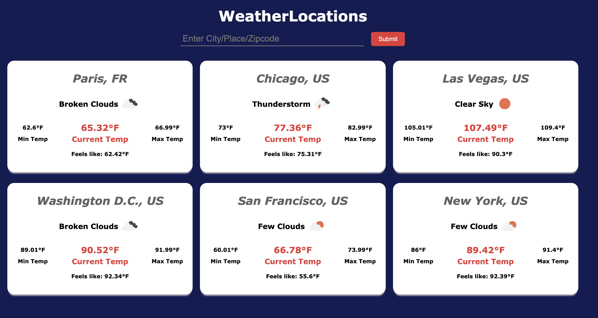
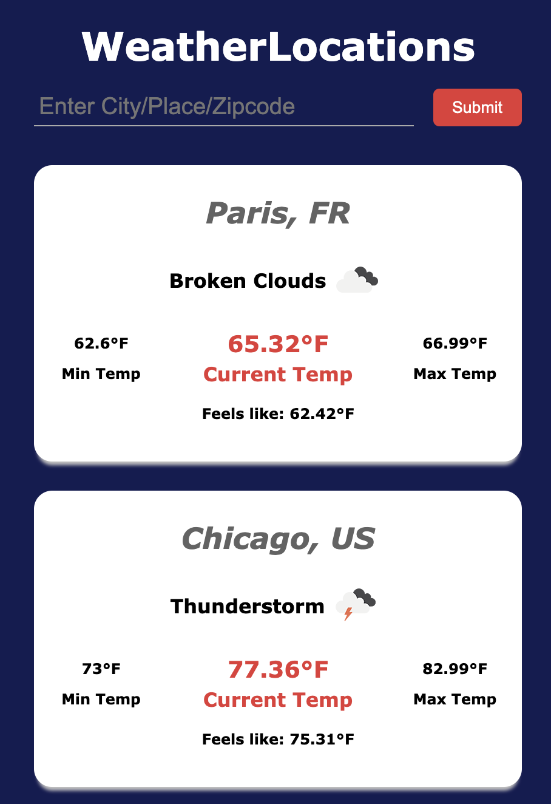

# WeatherLocations
 This is a simple responsive app that uses OpenWeather's API to get weather in multiple locations.
 App uses Fetch API to get weather data.

### Screenshots

This is how it looks on a desktop.



This is how it looks on a Mobile.


### Technologies Used:
HTML, CSS, Javascript, Fetch API

### To run: 
1. Get an API key by signing up on OpenWeather API: https://openweathermap.org/api
2. Create a file called "API.js" and place it into the WeatherLocations Directory and add your API key with the following code :

```javascript
class API{
    constructor(){
        this.apiKey = 'PUT_YOUR_API_KEY_HERE';
    }
    getKey(){
        return this.apiKey;
    }
}
```

3. Delete the .gitignore file
4. Launch in browser and run